<p align="center"></p>

# Terraform & Ansible Jenkins Deployment

Infrastructure as code for deploying a Jenkins CI/CD master/worker setup on AWS, combining Terraform for provisioning with Ansible for configuration.

## 🎯 Overview

This repository deploys Jenkins on AWS using **Terraform** for infrastructure and **Ansible** for configuration — a VPC, an Application Load Balancer, EC2 instances for Jenkins master and workers, security groups, DNS, and TLS via ACM.

## 🏗️ Architecture

**Infrastructure Components:**
- **AWS VPC** with public and private subnets
- **Application Load Balancer** for the Jenkins master
- **EC2 instances** for Jenkins master and workers
- **Security groups** with scoped access controls
- **DNS integration** for domain management
- **SSL/TLS certificates** via AWS ACM

## 📁 Contents

### Terraform Configuration
- **acm.tf** - SSL certificate management
- **alb.tf** - Application Load Balancer setup
- **backend.tf** - Terraform state backend configuration
- **dns.tf** - DNS routing and domain management
- **instances.tf** - Jenkins EC2 instance configuration
- **networks.tf** - VPC and networking setup
- **security_groups.tf** - Firewall and access rules
- **variables.tf** - Configuration variables
- **outputs.tf** - Deployment outputs
- **providers.tf** - AWS provider configuration

### Ansible Automation
- **ansible/templates/install_jenkins.yml** - Jenkins master installation
- **ansible/templates/jenkins-worker-sample.yml** - Worker configuration
- **ansible/templates/jenkins-master-sample.yml** - Master configuration
- **ansible/templates/install_worker.yml** - Worker setup
- **ansible.cfg** - Ansible configuration
- **ansible/templates/inventory_aws/** - Dynamic EC2 inventory

### Documentation
- **jenkins_aws_diagram.png** - Architecture diagram

## 🚀 Quick Start

### Prerequisites
```bash
# Install Terraform
# Install Ansible
# Configure AWS credentials
aws configure
```

### Deployment
```bash
# Clone the repository
git clone https://github.com/marcuspat/terraform_ansible_jenkins_deployment.git
cd terraform_ansible_jenkins_deployment

# Initialize Terraform
terraform init

# Plan deployment — review before applying
terraform plan

# Deploy infrastructure
terraform apply

# Configure Jenkins with Ansible
cd ansible
ansible-playbook -i inventory_aws/tf_aws_ec2.yml install_jenkins.yml
```

## 🔧 Configuration

### Required Variables
```hcl
# Example variables to set
variable "aws_region" {
  description = "AWS region for deployment"
  default     = "us-east-1"
}

variable "environment" {
  description = "Environment name"
  default     = "production"
}

variable "jenkins_instance_count" {
  description = "Number of Jenkins worker instances"
  default     = 2
}
```

### Ansible Configuration
The repository includes an `ansible.cfg` with:
- **Inventory settings** for AWS dynamic discovery
- **SSH configuration** for secure access
- **Jinja2 template** settings
- **Callback plugins** for logging
- **Retry patterns** for reliability

## 🛠️ Features

### Infrastructure
- **VPC with public/private subnets** - Multi-subnet layout
- **Load Balancing** - ALB for traffic to the Jenkins master
- **SSL/TLS** - HTTPS via ACM certificates
- **DNS Management** - Route53 integration

### Jenkins Configuration
- **Master-Worker Architecture** - Separate master and worker roles
- **Automated Installation** - Ansible-driven setup
- **Security Groups** - Scoped network access

### Security Features
- **Security Groups** - Network-level access control
- **IAM Roles** - AWS permissions scoped to the deployment
- **Key Management** - SSH key management
- **Network Isolation** - Private subnets for workers
- **SSL Encryption** - Data in transit protection

> **Not included:** this repo does not configure Auto Scaling or CloudWatch. Worker count is a fixed Terraform variable (`jenkins_instance_count`), not an autoscaling group, and there's no CloudWatch metrics/alarms wiring. Add both yourself if you need them.

## 📋 Architecture Diagram

`jenkins_aws_diagram.png` shows the VPC layout, load balancer placement, Jenkins master/worker placement, security group relationships, and network flow.

## 🎓 Use Cases

- Learning Terraform + Ansible integration for a real multi-service AWS deployment
- A starting point for a Jenkins CI/CD environment on AWS
- Reference for VPC/ALB/ACM/Route53 wiring in Terraform

## 🔧 Scaling

Worker count is set via a Terraform variable, applied manually:
```bash
# Change worker count
terraform apply -var="jenkins_instance_count=5"

# Add build agents via Ansible
cd ansible
ansible-playbook -i inventory_aws/ install_worker.yml
```

## 🤝 Contributing

Contributions welcome — this is a lab-grade reference deployment, not a maintained platform.

## 📚 Related Repositories

- **devops** - DevOps automation collection
- **Misc_Ansible_Playbooks** - Ansible playbook examples

## 📝 License

MIT — see [LICENSE](LICENSE).

---

**Terraform & Ansible Jenkins Deployment** — a lab-grade reference for deploying Jenkins on AWS with Terraform and Ansible.
